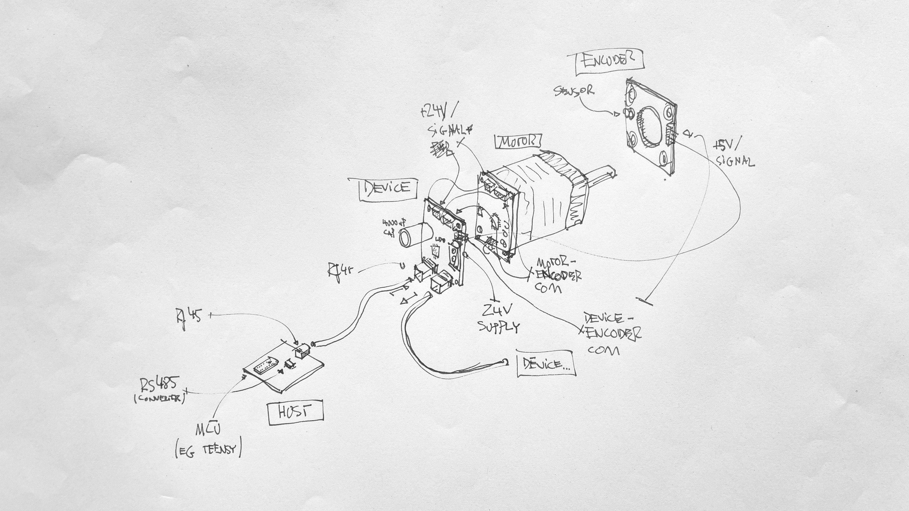
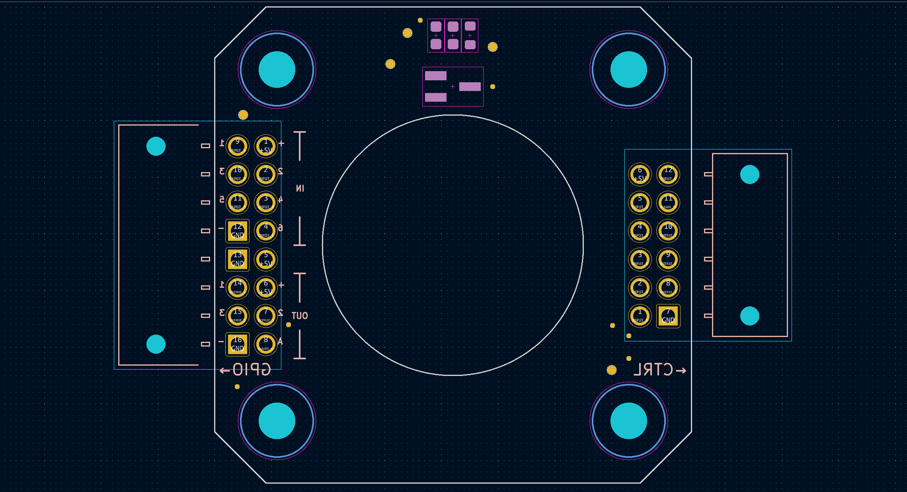
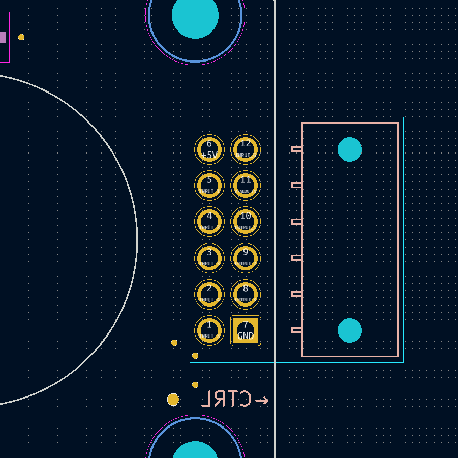
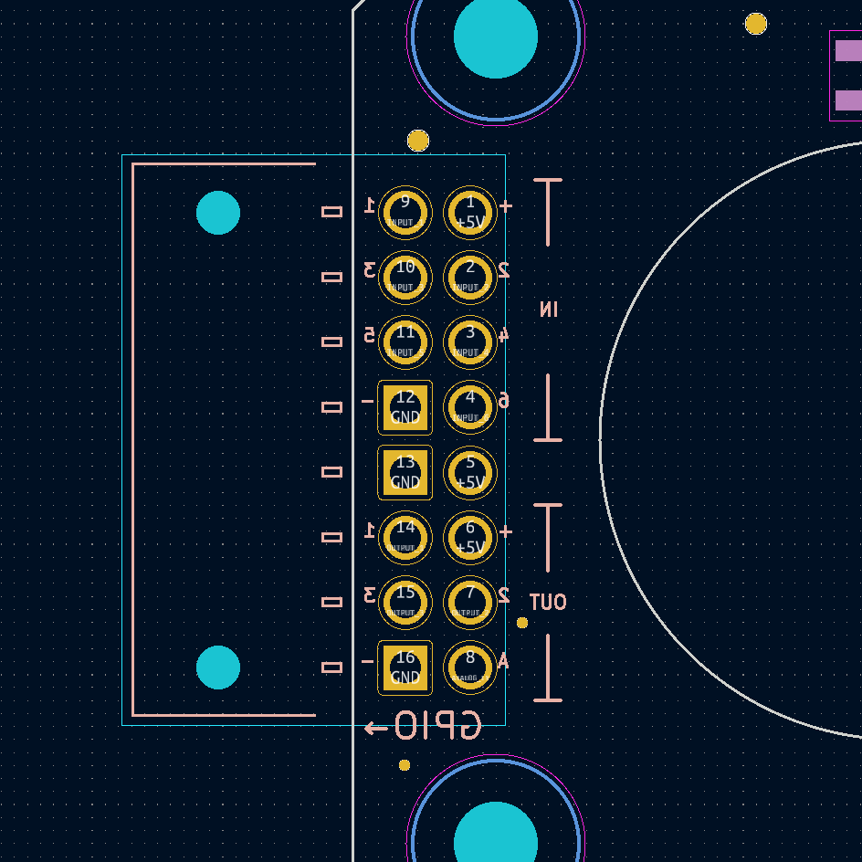
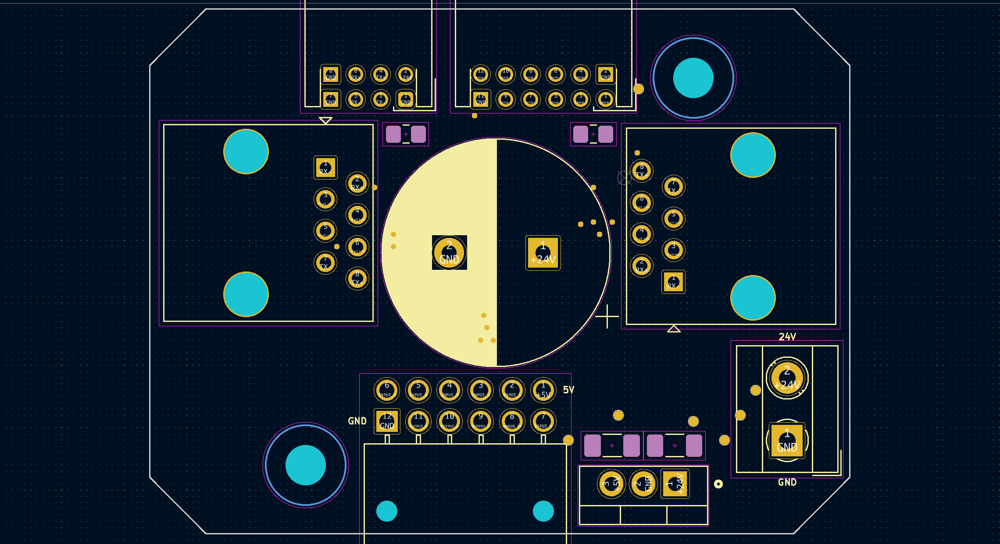
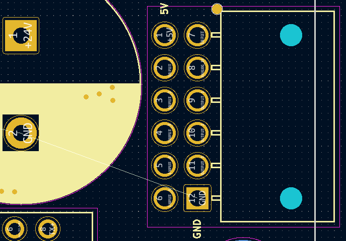

# Polytope XIa / hardware / motor

## layout

`DEVICE` is a unit that consists of a board that combines a power supply `POWER`, a connection to the `CONTROLLER` which drives the motor and connects to an `ENCODER` which allows the callibration of the motor position.

`HOST` is the entity that sends commands from main application to all motors.

```
─── HOST
     ├── DEVICE #1
     │   ├── CONTROLLER
     │   │    └── ENCODER
     │   └── POWER
     ...
     ├── DEVICE #12
     │   ├── CONTROLLER
     │   │    └── ENCODER
     │   └── POWER
```

## layout with protocols + interfaces

```
├── HOST ( TTL>RS485>RJ45 )
     │
     { RJ45 }
     │
     ├── DEVICE #1
     │    │
     │    { JSTPHD }
     │    │
     │    ├── CONTROLLER ( motor driver )
     │    │    │
     │    │    { JSTPHD }
     │    │    │
     │    │    └── ENCODER ( drehgeber )
     │    │
     │    { TERMINAL }
     │    │
     │    └── POWER ( 24V power supply )
     ...
```

## layout sketched



## motor connectors

all connectors are viewed from top. pin numbering is according to pin numbers in PCB design.

### encoder (ENCODER) board



note, connectors are attached to back side while the tables below assume a top view.

#### (ENCODER)→CTRL



|  FUNCTION | PIN | PIN | FUNCTION  |
|----------:|:----|----:|:----------|
|       +5V | 06  | 12  | INPUT_6   |
|   INPUT_1 | 05  | 11  | ANALOG_IN |
|   INPUT_2 | 04  | 10  | OUTPUT_1  |
|   INPUT_3 | 03  | 09  | OUTPUT_2  |
|   INPUT_4 | 02  | 08  | OUTPUT_3  |
|   INPUT_5 | 01  | 07  | GND       |

#### (ENCODER)→GPIO



| FUNCTION  | PIN | PIN | FUNCTION  |
|----------:|:----|----:|:----------|
|   INPUT_1 | 09  | 01  | +5V       |
|   INPUT_3 | 10  | 02  | INPUT_2   |
|   INPUT_5 | 11  | 03  | INPUT_4   |
|       GND | 12  | 04  | INPUT_6   |
|       GND | 13  | 05  | +5V       |
|  OUTPUT_1 | 14  | 06  | +5V       |
|  OUTPUT_3 | 15  | 07  | OUTPUT_2  |
|       GND | 16  | 08  | ANALOG_IN |

### device controller (CTRL) board



#### (CTRL)→ENCODER



|  FUNCTION | PIN | PIN | FUNCTION  |
|----------:|:----|----:|:----------|
|       +5V | 01  | 07  | INPUT_6   |
|   INPUT_1 | 02  | 08  | ANALOG_IN |
|   INPUT_2 | 03  | 09  | OUTPUT_1  |
|   INPUT_3 | 04  | 10  | OUTPUT_2  |
|   INPUT_4 | 05  | 11  | OUTPUT_3  |
|   INPUT_5 | 06  | 12  | +5V       |
