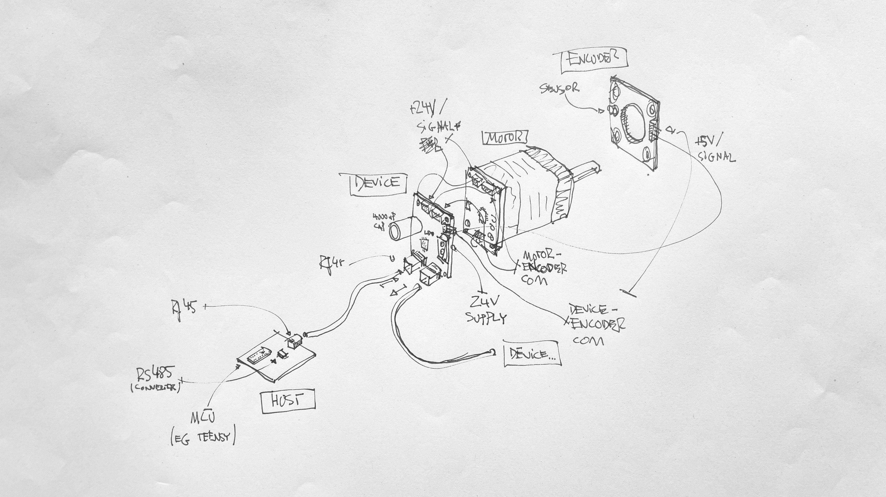

# Polytope XIa / hardware / motor

## layout

`DEVICE` is a unit that consists of a board that combines a power supply `POWER`, a connection to the `CONTROLLER` which drives the motor and connects to an `ENCODER` which allows the callibration of the motor position.

`HOST` is the entity that sends commands from main application to all motors.

```
─── HOST
     ├── DEVICE #1
     │   ├── CONTROLLER
     │   │    └── ENCODER
     │   └── POWER
     ...
     ├── DEVICE #12
     │   ├── CONTROLLER
     │   │    └── ENCODER
     │   └── POWER
```

## layout with protocols + interfaces

```
├── HOST ( TTL>RS485>RJ45 )
     │
     { RJ45 }
     │
     ├── DEVICE #1
     │    │
     │    { JSTPHD }
     │    │
     │    ├── CONTROLLER ( motor driver )
     │    │    │
     │    │    { JSTPHD }
     │    │    │
     │    │    └── ENCODER ( drehgeber )
     │    │
     │    { TERMINAL }
     │    │
     │    └── POWER ( 24V power supply )
     ...
```

## layout sketched


